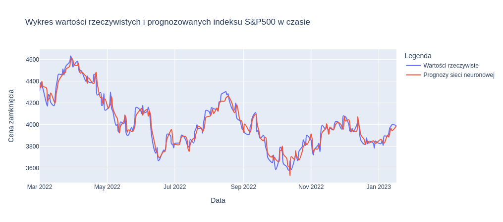

# Projekt sieci neuronowej przewidującej ceny akcji - część opisowa

## Co to są sieci neuronowe?

Sieć neuronowa – system przeznaczony do przetwarzania informacji, którego budowa i zasada działania są w pewnym stopniu wzorowane na funkcjonowaniu fragmentów rzeczywistego (biologicznego) systemu nerwowego. Na przesłankach biologicznych oparte są schematy sztucznych neuronów wchodzących w skład sieci oraz (w pewnym stopniu) jej struktura. Jednak schematy połączeń neuronów w sieci neuronowej są wybierane arbitralnie, a nie stanowią modelu rzeczywistych struktur nerwowych.

Wyróżniającą cechą sieci neuronowej jako narzędzia informatycznego jest możliwość komputerowego rozwiązywania przy jej pomocy praktycznych problemów bez ich uprzedniej matematycznej formalizacji. Dalszą zaletą jest brak konieczności odwoływania się przy stosowaniu sieci do jakichkolwiek teoretycznych założeń na temat rozwiązywanego problemu.

Sztuczna sięc neuronowa to tylko jeden z wielu rodzajów algorytmów uczenia maszynowego. Z kolei uczenie maszynowe to poddziedzina sztucznej inteligencji, jedna z dróg do osiągnięcia ogólnej sztucznej inteligencji.

Niezależnie od stosowanego nazewnictwa model sieci neuronowej jest jednym z najważniejszych w uczeniu maszynowym, szybko ewoluującym wraz z przełomową koncepcją uczenia głebokiego.

Ważniejsze kierunki zastosowania sieci neuronowych:

* predykcja
* klasyfikacja i rozpoznanie
* kojarzenie danych
* analiza danych
* filtracja sygnałów
* optymalizacja

Najprostsza sieć neuronowa składa się z trzech warstw: wejściowej, ukrytej i wyjściowej.

Warstwa jest zbiorem węzłów (zwanych również jednostkami), odzwierciedlających neurony w biologicznym mózgu. Warstwa wejściowa reprezentuje cechy wejściowe, a każdy węzeł prognozowaną cechę x. Warstwa wyjściowa reprezentuje zmienne docelowe.

W klasyfikacji binarnejj warstwa wyjściowa składa się z pojedynczego węzła, którego wartość jest prawdopodobieństwem uzyskania klasy dodatniej. W klasyfikacji wieloklasowej warstwa wyjściowa jest złożona z n węzłów, a wartością każdego z nich jest prawdopodobieństwo prognozy każdej z n klas. W regresji warstwa wyjściowa również składa się z pojedynczego węzła, którego wartością jest prognozowany wynik.

Warstwę ukrytą można traktowaćjako kompozycję ukrytych informacji wyodrębnionych z poprzedniej warstwy. Tego rodzajuwarstw może być więcej niż jedna. Trenowanie sieci neuronowej składającej się z dwóch lub więcej warstw nosi nazwę uczenia głębokiego.

Dwie sąsiednie warstwy są ze sobą połączone za pomocą krawędzi(odpowiedników synaps w biologicznym móżgu), po których węzły przesyłają sygnały. Parametrami krawędzi są wagi w.

W typowej sieci neuronowej dane przepływają z warstwy wejściowej poprzez jedną lub kilka warstw ukrytych do warstwy wyjściowej. Jest to tzw. jednokierunkowa sieć neuronowa.

### Funkcja aktywacji

Funkcja ta jak nazwa sugeruje, sprawdza, jak jest aktywowany węzeł. Symuluje w ten sposób działanie biologicznego mózgu. Funkcja oblicza wartość wyjścia neuronów sieci neuronowej. Typowe funkcje aktywacji to sigmoida(nazwana również funkcją logistyczną), tangens hiperboliczny oraz ReLU(ang. Rectified Linear Unit)

## Wprowadzenie do giełdy i cen akcji

Posiadanie akcji firmy oznacza udział w jej własności. Pojedyncza akcja w stosunku do całkowitej liczby akcji reprezentuje ułamek aktywów i zysków firmy, do których prawo rości sobie inwestor (udziałowiec). Na przykład 50 akcji spośród 1000 wszystkich daje prawo do 5% aktywów i zysków firmy.

Udziałowcy obracają akcjami za pośrednictwem giełdy i instytucji finansowych. Największe Światowe giełdy to New York Stock Exchange, NASDAQ, London Stock Exchange Group, Shanghai Stock Exchange oraz Hong Kong Stock Exchange. Ceny, po których handluje się akcjami, zmieniają się zgodnie z prawem popytu i podaży. Podaż to liczba akcji znajdujących się w rękach inwestorów, a popyt to liczba akcji, które inwestorzy chcą kupić. Cena akcji zmienia się w górę i w dół tak, aby została osiągnięta i utrzymana równowaga między podażą a popytem.

Upraszczając: inwestorzy chcą kupować tanio i sprzedawać drogo. Latwo jest to powiedzieć, ale gorzej z realizacją, ponieważ niezwykle trudno jest przewidzieć, czy cena akcji wzrośnie, czy spadnie. Istnieją dwa główne nurty badań czynników i warunków wpływających na zmiany, a nawet umożliwiających prognozowanie cen akcji:
* Analiza fundamentalna, koncentruje się na podstawowych czynnikach wpływających na wartość i działalność firmy, w tym na ogólna gospodarke i warunki branżowe z perspektywy makro, jak również na kondycje finansowa firmy, zarządzanie i konkurencje z perspektywy mikro.
* Analiza techniczna, prognozująca ruchy cen na podstawie statystycznych badań handlowej historii akcji, ich liczby, ruchów cen oraz danych rynkowych. Prognozowanie cen za pomocą technik uczenia maszynowego jest obecnie ważnym tematem w analizie technicznej.

Wiele firm finansowych wykorzystuje algorytmy uczenia maszynowego do usprawniania i automatyzowania jakościowego i ilościowego swojej aktywności handlowej na giełdzie.

### Pozyskiwanie cen akcji
Teoretycznie techniki analizy można stosować do prognozowania cen dowolnych akcji. Jednak trudno jest stwierdzić, czy wybrane akcje nadają się do celów edukacyjnych. Ich cena powinna być zgodna z pewnymi możliwymi do wyuczenia wzorcami i nie mogą na nią wpływać wyjątkowe przypadki i losowe zdarzenia.

Wyjaśnijmy przede wszystkim, czym jest indeks giełdowy. Jest to statystyczna miara wartości części rynku akcji. Indeks obejmuje pewna liczbę akcji, które sa na tyle zróżnicowane, że mogą reprezentować cały rynek. Wartość indeksu jest zazwyczaj średnią ważona tych akcji.
Jednym z najstarszych i najczęściej stosowanych indeksów na świecie jest Dow Jones Industrial Average (DJIA). Obejmuje on akcje 30 największych firm amerykańskich, m.in. Microsoftu, Apple, General Electric i Walt Disney Company, zajmujących mniej więcej czwarta część całego rynku.

W każdym dniu handlowym ceny akcji zmieniają się i są rejestrowane na bieżąco. Ruchy cen w jednostce czasu (zwykle w ciągu jednego dnia, ale może to być równie: tydzień lub miesiąc) opisuje pięć kluczowych wskaźników:
* otwarcie (ang. open): początkowa cena w danym dniu handlowym;
* zamknięcie (ang. close): końcowa cena w danym dniu;
* maksimum (ang. high): najwyższa cena w danym dniu;
* minimum (ang. low): najniższa cena w danym dniu;
* wolumen (ang. volume): całkowita liczba akcji sprzedawanych danego dnia.

Oprócz DJIA istnieje kilka innych ważnych indeksów giełdowych:
* S&P 500 (skrót od Standard & Poor's 500): indeks obejmujący akcje 500 firm o największej kapitalizacji, posiadających 80% amerykańskiego rynku;
* NASDAQ Composite: indeks obejmujący wszystkie akcje dostępne na giełdzie;
* Russell 2000 (RUT): indeks obejmujący akcje 2000 spośród 3000 amerykańskich publicznych spółek o najmniejszej kapitalizacji;
* London FTSE-100: indeks obejmujący aleje 100 największych firm notowanych na giełdzie London Stock Exchange.

### Inżynieria cech 

Rozpoczynając prace nad algorytmem uczenia maszynowego, należy przede wszystkim zadać sobie pytanie, jakie są dostępne cechy lub zmienne predykcyjne.

Czynnikami wykorzystywanymi do prognozowania indeksu giełdowego i cen zamknięcia są historyczne i bieżące ceny otwarcia, jak również historyczne wskaźniki (maksimum, minimum, wolumen). Należy pamiętać, aby nie uwzględniać aktualnych wskaźników, tj. z bieżącego dnia, ponieważ po prostu nie można przewidzieć najwyższej i najniższej ceny ani liczby sprzedanych akcji przed zamknięciem sesji danego dnia.

Prognozowanie cen zamknięcia wyłącznie na podstawie czterech wymienionych wyżej wskaźników nie wygląda obiecująco i może skutkować niedopasowaniem modelu. Dlatego trzeba się zastanowić nad sposobem generowania większej liczby cech, które zwiększyłyby moc predykcyjną. Dla przypomnienia, inżynieria cech w uczeniu maszynowym jest procesem tworzenia cech charakterystycznych dla danej dziedziny, na podstawie istniejących cech, w celu zwiększenia skuteczności algorytmu.

Inżynieria cech zazwyczaj wymaga szerokiej wiedzy z danej dziedziny, a jej realizacja może być bardzo trudna i czasochłonna. W praktyce cechy niezbędne do rozwiązania danego problemu zazwyczaj nie są dostępne wprost. Trzeba je specjalnie zaprojektować i skonstruować.

Są to na przykład częstości TFIDF występowania terminów w tekstach, spamie e-mail i grupach dyskusyjnych. Dlatego inżynieria cech jest w uczeniu maszynowym niezbędna i zwykle wkłada się w nią najwięcej wysiłku podczas rozwiązywania praktycznego problemu
Inwestorzy, podejmujac decyzje inwestycyjna, zazwyczaj patrza nie tylko na ceny z poprzedniego dnia, ale również, z pewnego okresu. Dlatego w naszym projekcie wyliczono trzy nowe cechy: średnie ceny zamknięcia za ostatni tydzień (pięć dni handlowych), miesiąc i rok. Okno czasowe można też dostosować do innego przedziału, na przykład ostatniego kwartału lub półrocza. Oprócz powyższych trzech uśrednionych cen można generować inne wskaźniki odzwierciedlające trendy, na przykład stosunki średnich cech w trzech różnych przedziałach czasu, w ostatnim tygodniu lub roku.

Oprócz ceny innym ważnym czynnikiem analizowanym przez inwestorów jest wolumen.
Tutaj też można generować nowe cechy, obliczając średnie wolumeny w kilku różnych przedziałach czasu, jak również stosunki między wszystkimi parami uśrednionych wartości.
Inwestorzy dokładnie analizują również zmienność akcji lub indeksu w czasie. W terminologii statystycznej jest to odchylenie standardowe cen zamknięcia. Nowe cechy można łatwo wygenerować, wyliczając odchylenie standardowe cen zamknięcia i wolumenu za określony przedział czasu. Na podobnej zasadzie można do puli wykreowanych cech dodać stosunki wszystkich wartości odchylenia standardowego.

I wreszcie, wskaźnikiem finansowym, na który inwestorzy uważnie patrzą. jest zwrot z inwestycji, czyli procentowy wzrost lub spadek ceny zamknięcia akcji/indeksu w określonym okresie. Na przykład często słyszy sie o zwrocie dziennym lub rocznym.

Utworzone cechy na podstawie, których dokonywano trenowania moedlu i predykcji widoczne są w funckji *generate_features*.

## Cel projektu

Celem projektu było zaprojektowanie sieci neuronowej do przewidywania kursów spółek lub indeksów giełdowych. Projekt wykonano na przykładzie indeksu giełdowego S&P 500, w skład którego wchodzi 500 przedsiębiorstw o największej kapitalizacji, notowanych na New York Stock Exchange i NASDAQ. Są to głównie przedsiębiorstwa amerykańskie.

## Opis założeń i metodyki trenowania sieci neuronowej

* Zbiór danych: wartośći indeksu giełdowego S&P 500 z lat 1971-2022
* Funkcja aktywacji w warstwie(warstwach) ukrytych: ReLU
* Użyte biblioteki do stworzenia sieci neuronowej: TensorFlow, Keras, scikit-learn
* Dostrojenie liczby warst ukrytych, liczby węzłów w wartswie ukrytej, liczby iteracji i szybkości uczenia się 

## Opis zastosowanych metod 

### Zapobieganie nadmiernemu dopasowaniu sieci

Sieć neuronowa o odpowiednio dobranej liczbie ukrytych warstw i węzłów jest potężnym narzędziem, które potrafi rozpoznawać hierarchiczne cechy danych o odpowiedniej architekturze. Jest bardzo elastyczna i potrafi przetwarzać skomplikowane informacje. Jednak ta zaleta staje się wadą, jeżeli nie można odpowiednio kontrolować procesu uczenia. W szczególności sieć dobrze dostosowana do zbioru treningowego może by nadmiernie dopasowana i nie uogólniać nieznanych sobie wcześniej danych. Dlatego też, zapobieganie nadmiernemu dopasowaniu ma kluczowe znaczenie dla zbudowania skutecznej sieci neuronowej.
Istnieją trzy główne techniki nakładania ograniczeń na sieć neuronową; regularyzacja L1/L2, dropout i wczesne zakończenie treningu (ang. early stopping). 

#### Dropout

Technika dropout (pol. „odrzucanie"') polega na pomijaniu na etapie treningu niektórych węzłów warstwy ukrytej. Węzły te wybiera się losowo z określonym prawdopodobieństwem.
Podczas przekazywania danych wprzód w fazie treningu losowo wybrane węzły nie są wykorzystywane do wyliczania straty, a podczas przekazywania danych wstecz tymczasowo nie są aktualizowane.

Węzły typowej warstwy są połączone ze wszystkimi węzłami warstwy ją poprzedzającej. Duza sieć zapamiętuje zależności pomiędzy poszczególnymi parami węzłów, co prowadzi do jej nadmiernego dopasowania. Technika dropout zaburza te zależności poprzez tymczasowe dezaktywowanie niektórych węzłów w każdej iteracji, dzięki czemu skutecznie zapobiega nadmiernemu dopasowaniu, nie zakłócając procesu uczenia.
Odsetek losowo wybieranych w każdej iteracji węzłów nosi nazwę współczynnika odrzucenia (ang. dropout rate). W praktyce nie stosuje sig wartości większych niż 50%. Do wrowadzenia dropoutu do warstwy sieci służy moduł *tf.keras.layers.Dropout* zawarty w bibliotece Keras.

Dropout ma miejsce tylko w fazie treningu. W fazie prognozowania wszystkie węzły są w pełni połączone.

#### Wczesne zakończenie treningu

Jak sugeruje nazwa, tytułowa technika polega na wcześniejszym zakończeniu treningu, jeżeli po wykonaniu określonej liczby iteracji skuteczność modelu się nie poprawia. Skuteczność modelu i jego zdolność uogólniania danych ocenia się podczas przetwarzania zbioru testowego, innego niż treningowy. Jeżeli model po wykonaniu określonej liczby iteracji treningowych (na przykład 50) wykazuje gorszą skuteczność, oznacza to, że jest nadmiernie dopasowany i nie jest w stanie uogólniać prognoz. W takim przypadku wcześniejsze zakończenie treningu zapobiega temu efektowi.

### Sequential

* grupuje liniowy stos warstw w model tf.keras.Model.

* zapewnia funkcje szkolenia i wnioskowania na tym modelu.

### Dense layer

Zwykła gęsto połączona warstwa NN.

Dense implementuje operację: *output = activation(dot(input, kernel) + bias)*, gdzie activation jest funkcją aktywacji według pierwiastków przekazaną jako argument aktywacji, kernel jest macierzą wag utworzoną przez warstwę, a bias jest wektorem bias utworzonym przez warstwę (ma zastosowanie tylko jeśli *use_bias* jest True). Wszystkie te atrybuty są atrybutami Dense.

Poza tym atrybuty warstwy nie mogą być modyfikowane po jej jednokrotnym wywołaniu (poza atrybutem trainable). Gdy zostanie przekazany popularny kwarg *input_shape*, wówczas keras utworzy warstwę wejściową, którą wstawi przed bieżącą warstwą. Można to potraktować jako odpowiednik jawnego zdefiniowania *InputLayer*.

### Optymalizator Adam

Optymalizator implementujący algorytm Adam.

Optymalizacja Adam jest stochastyczną metodą zstępowania gradientowego, która opiera się na adaptacyjnej estymacji momentów pierwszego i drugiego rzędu.

Według Kingma et al., 2014, metoda ta jest "wydajna obliczeniowo, ma niewielkie zapotrzebowanie na pamięć, jest niezmiennicza dla diagonalnego przeskalowania gradientów i dobrze nadaje się do problemów, które są duże pod względem danych/parametrów".

### model.compile()

Konfiguruje model do szkolenia.

### model.fit()

Trenuje model przez ustaloną liczbę epok (iteracji na zbiorze danych).

### model.predict()

Generuje prognozy wyjściowe dla próbek wejściowych.

Obliczenia wykonywane są w partiach. Metoda ta została zaprojektowana do przetwarzania partii dużych ilości danych wejściowych. Nie jest przeznaczona do użycia wewnątrz pętli, które iterują po danych i przetwarzają małą liczbę wejść na raz.

### model.evaluate()

Zwraca wartość straty i wartości metryk dla modelu w trybie testowym.

Obliczenia wykonywane są w partiach.

### tf.keras.callbacks.TensorBoard()

Tworzy panel prezentujący dane wyjściowe i wskaźniki skuteczności podczas treningu i testu modelu.

### hp.KerasCallback()

Rejestruje w dzienniku wartości hiperparametrów i wskaźników

### tf.keras.callbacks.EarlyStopping()

Kontroluje skuteczność modelu podczas przetwarzania zbioru weryfikacyjnego, którym w tym projekcie jest sposób testowy. Jeżeli po wykonaniu 200 iteracji błąd średniokwadratowy nie będzie się zmniejszał, funkcja zakończy trening.

## Analiza otrzymanych wyników

Przeprowadzone dostrajanie hiperparametrów sieci neuronowej pokazało, że najefektywniejsze wartości dla nich to:
* layers=3 - suma liczby warstw ukrytych i warstwy wyjściowej, więc w tym przypadku to dwie warstwy ukryte
* hidden_size=64 - liczba warstw w pierwszej warstwie ukrytej, druga ma połowę tej wartości
* epochs=1000 - liczba iteracji
* learning_rate=0.4 - szybkość uczenia się

Stosując takie hiperparametry otrzymujem współczynnik R^2^ równy 0.95506. Możemy uznać, że jest to bardzo dobre dopasowanie sieci neuronowej. Potwierdza to wykres porównujący wartośći rzeczywiste do prognozowanych:

## Podsumowanie

Przeprowadzone analizy i obliczenia doprowadziły do uzyskania modelu sieci neuronowej, który ma wysoką trafność prognoz. Niestety problemem są prognozy w dniach, gdzie następowała duża zmiana wartośći indeksu. Model w takich miejscach nie potrafi dobrze określić wielkości takiej zmiany. Mimo tego uważam go za całkiem udany.

Należy jednak pamiętać, że prognozowanie zmiany cen akcji czy indeksów giełdowych jest szalenie trudne, ponieważ na te zmiany wpływa wiele czynników. Przede wszystkim dużą rolę odkrywa czynnik ludzki, czyli psychika i uczucia inwestorów. Jak wiemy maszyny nie potrafią naśladować istot rozumnych pod tym względem. Co więcej, mogę wystąpić na świecie zdarzenia o których nie spodziewa się większość ludzi. Zdarzenia te potrafią wywrócić rynki finansowe do góry nogami i zależności na nich panujące. Biorąc pod uwagę te czynniki, musimy mieć na uwadzę, że model takiej sieci neuronowej nie jest w stanie w 100% przewidzieć zmian na rynkach finansowych.

### Źródła:
* [wikipedia](https://pl.wikipedia.org/wiki/Sie%C4%87_neuronowa)
* Yuxi Hayden Liu, *Uczenie maszynowe w przykładach TensorFlow 2, PyTorch scikit-learn*, Helion, Gliwice, 2022